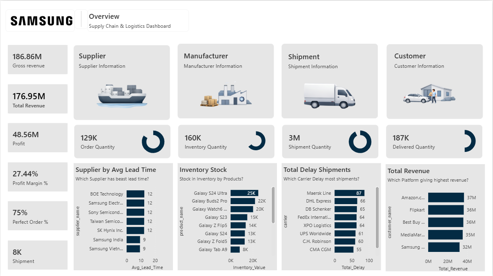
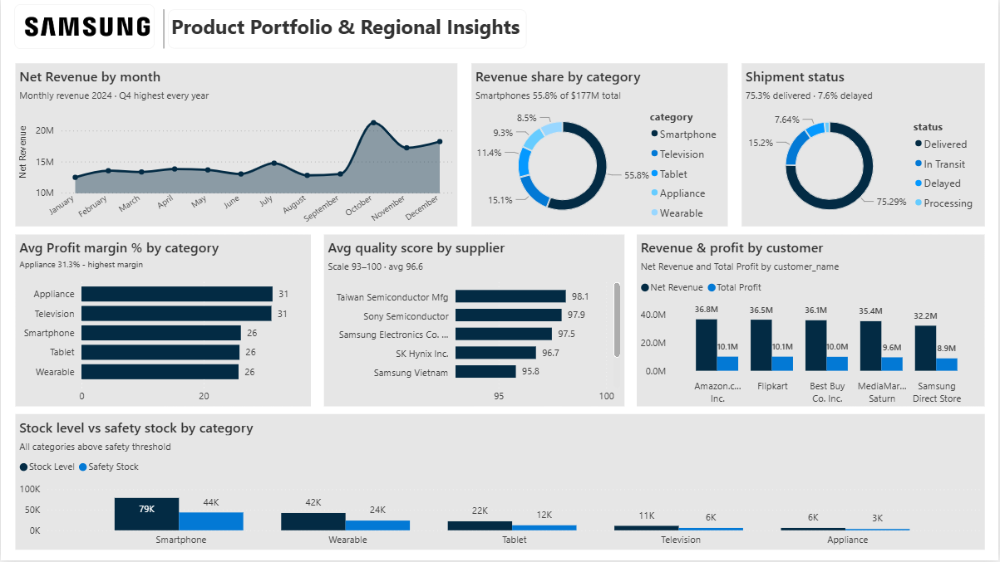

# Samsung Supply Chain & Logistics Dashboard
### Power BI | DAX | Data Modeling | Supply Chain Analytics


---

## Overview

An end-to-end supply chain analytics dashboard built in Power BI, modeled on Samsung Electronics' product and logistics operations. The project covers the full supply chain lifecycle — from procurement and production to inventory management, shipments, and customer sales — using a dimensional data model with 10 tables and nearly 24,000 records.

The dashboard is designed to help supply chain managers and business analysts monitor KPIs, identify bottlenecks, and make data-driven decisions across five key operational domains.

---

## Dashboard Pages

### Page 1 — Overview
A high-level command center displaying the most critical supply chain KPIs at a glance.

- **$186.86M** Gross Revenue · **$176.95M** Total Revenue · **$48.56M** Profit
- **27.44%** Profit Margin · **75%** Perfect Order Rate · **8K** Total Shipments
- Supplier lead time comparison across 7 suppliers
- Inventory stock levels by product (top 8 SKUs)
- Total delayed shipments by carrier
- Revenue breakdown by customer/platform

### Page 2 — Product Portfolio & Regional Insights
Deep-dive into product performance, supplier quality, and inventory health.

- Monthly net revenue trend with Q4 seasonality insight
- Revenue share by category (Smartphones = 55.8% of $177M)
- Shipment status breakdown (75.3% delivered · 7.6% delayed)
- Average profit margin by product category
- Supplier quality scores (scale 93–100, avg 96.6)
- Revenue & profit by customer
- Stock level vs safety stock by category — all categories above safety threshold

---

## Data Model

Star schema with **5 fact tables** and **5 dimension tables**.

### Fact Tables
| Table | Rows | Description |
|---|---|---|
| `fact_sales` | 8,501 | Revenue, profit, discount, quantity by order |
| `fact_shipment` | 7,501 | Carrier, status, delay reason, shipping cost |
| `fact_production` | 4,501 | Units produced, defect rate, batch info |
| `fact_procurement` | 2,201 | Supplier orders, lead time, quality score |
| `fact_inventory` | 1,153 | Stock level, safety stock, reorder point |

### Dimension Tables
| Table | Description |
|---|---|
| `dim_product` | 17 products across 5 categories (Smartphone, Tablet, TV, Appliance, Wearable) |
| `dim_customer` | 6 customers across Online, Retailer, and Direct channels |
| `dim_supplier` | 8 suppliers (Tier 1 & Tier 2) with quality scores |
| `dim_facility` | 7 facilities (Manufacturing & Warehouse) |
| `dim_date` | Full date dimension with year, quarter, month, week |

---

## DAX Measures (20+)

Key measures built in a dedicated `Measures_Table`:

| Measure | Description |
|---|---|
| `Total_Revenue` | Net revenue after discounts |
| `Total_Profit` | Gross revenue minus total cost |
| `Profit_Margin_%` | Profit as % of gross revenue |
| `Perfect_Order_%` | % of shipments delivered without delay |
| `Avg_Lead_Time` | Average procurement lead time in days |
| `Avg_Quality_Score` | Average supplier quality score |
| `Inventory_Coverage_Ratio` | Stock level relative to safety stock |
| `Inventory_Value` | Total monetary value of current inventory |
| `Delay_Rate_Pct` | % of shipments with delayed status |
| `Total_Delivered_Quantity` | Quantity of units successfully delivered |
| `Total_Shipment_Quantity` | Total units shipped across all carriers |
| `Defect_Rate` | Production defect rate percentage |
| `Revenue_Share_Pct` | Category revenue as % of total |
| `Order_QTY` | Total procurement order quantity |
| `Total_Safety_Stock` | Aggregated safety stock across all products |

---

## Key Insights

- **Smartphones dominate revenue** at 55.8% of total — but Appliances have the highest profit margin at 31.3%
- **Q4 is consistently the strongest quarter** — October–November shows the sharpest revenue spike in the monthly trend
- **Maersk Line causes the most shipment delays** (87 delayed), followed by DHL Express (66) and DB Schenker (65)
- **Galaxy S24 Ultra has the highest inventory value** at 25K units in stock
- **All product categories are above safety stock thresholds** — no stockout risk at current levels
- **Taiwan Semiconductor Mfg** leads supplier quality at 98.1/100
- **Amazon.com is the top revenue platform** at $37M, closely followed by Flipkart ($36M) and Best Buy ($36M)

---

## Tools & Technologies

- **Power BI Desktop** — Report design, data modeling, DAX
- **DAX (Data Analysis Expressions)** — 20+ custom measures
- **Star Schema Design** — Dimensional modeling with fact & dimension tables
- **Power Query (M)** — Data transformation and loading
- **CSV** — Source data format

---

## How to Run This Project

1. Clone or download this repository
2. Open `Samsung_PowerBI_Project.pbix` in **Power BI Desktop**
3. If prompted to reconnect data sources, point them to the `/data` folder in this repo
4. All visuals and measures will load automatically

> Power BI Desktop is free to download at [microsoft.com/power-bi](https://powerbi.microsoft.com/desktop/)

---

## Dashboard Screenshots

### Page 1 — Overview


> High-level command center: $186.86M gross revenue · $48.56M profit · 27.44% margin · 75% perfect order rate · supplier lead times · inventory stock · delay analysis · revenue by platform

---

### Page 2 — Product Portfolio & Regional Insights


> Deep-dive: monthly revenue trend (Q4 peak) · revenue share by category (Smartphones 55.8%) · shipment status · profit margin by category · supplier quality scores · stock vs safety stock

---

## Project Structure

```
Samsung-Supply-Chain-PowerBI/
├── README.md
├── Samsung_PowerBI_Project.pbix
├── data/
│   ├── dim_customer.csv
│   ├── dim_date.csv
│   ├── dim_facility.csv
│   ├── dim_product.csv
│   ├── dim_supplier.csv
│   ├── fact_inventory.csv
│   ├── fact_procurement.csv
│   ├── fact_production.csv
│   ├── fact_sales.csv
│   └── fact_shipment.csv
└── screenshots/
    ├── overview_dashboard.png
    └── product_portfolio.png
```

